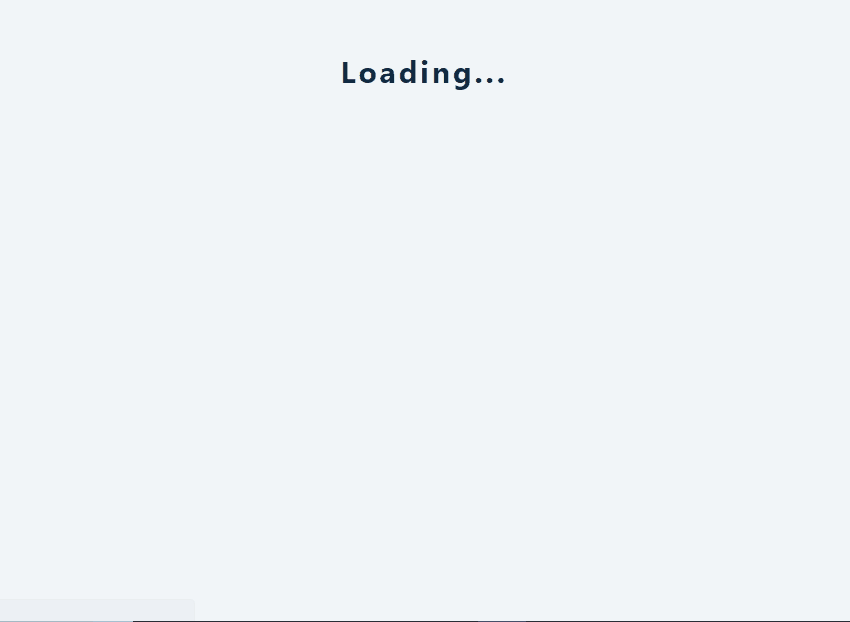

### React Shopping cart - useContext & useReducer

[view page](https://femi-ologunwa.github.io/shopping-cart/)

### Implementation

-  Implement react context for data flow between components
-  Show how to dispatch various actions that determines state transition in the reducer
-  Using useEffect to dispatch an action everytime a state property changes.
-  Dispatching an action to fetch data from an api
